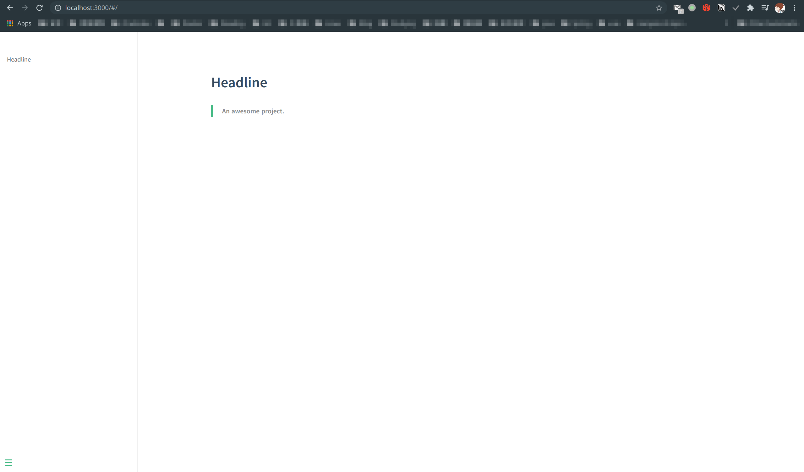
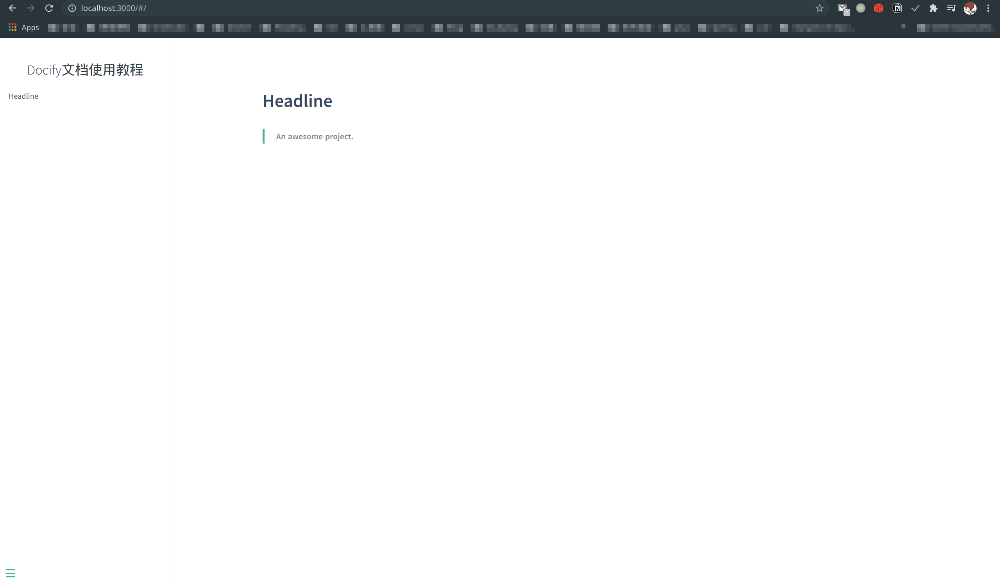
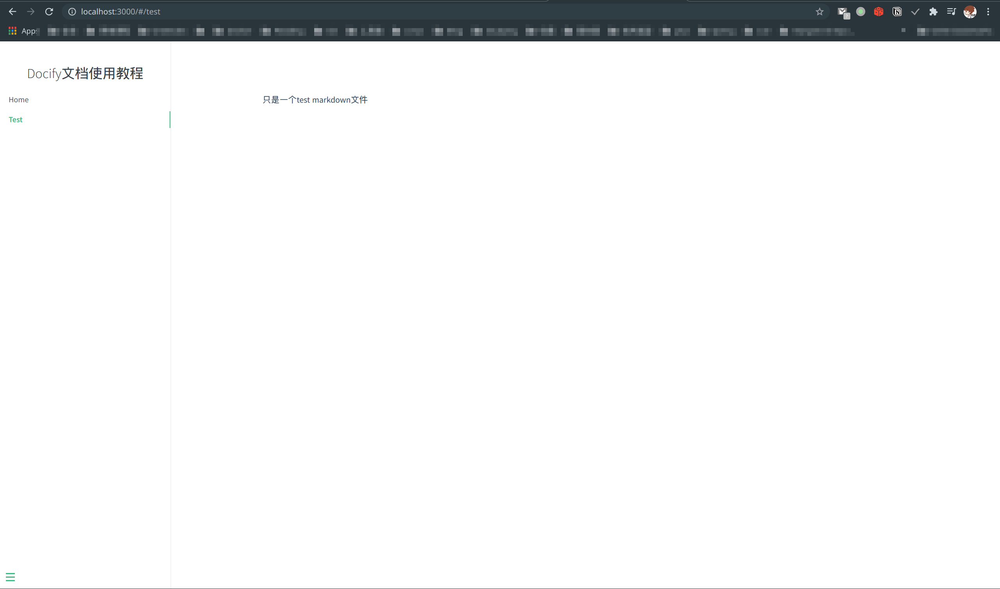
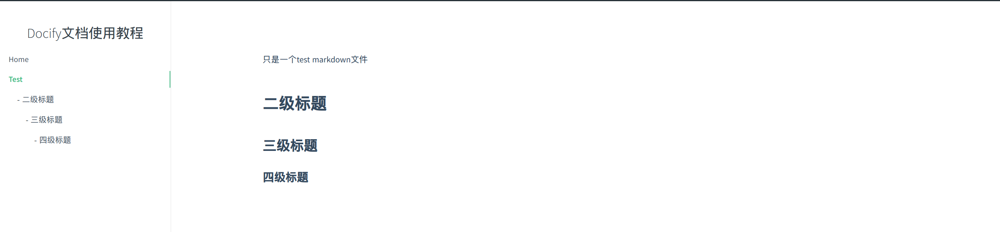
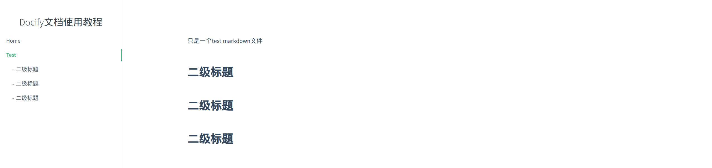
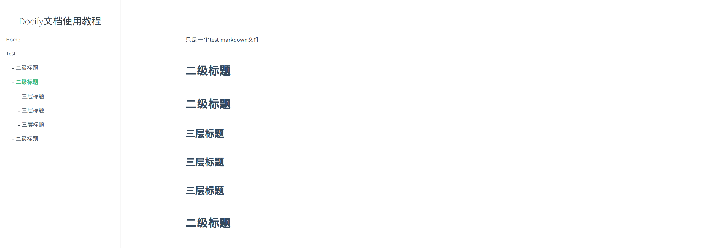
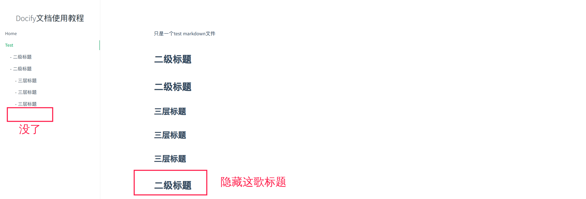
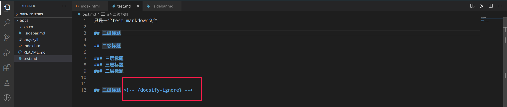

[toc]

## 1.安装nodejs环境
https://gitee.com/shafish/ToolMan/blob/master/manjaro_i3wm/i3-user-guide.md#%E5%AE%89%E8%A3%85nodejs

## 2.安装docsify-cli模块
`npm i docsify-cli -g`

## 3.初始化一个docsify目录
`docsify init ./docs`  # 不用先创建docs目录，直接执行命令即可。

## 4.运行你的第一个docsify项目
`cd docs && docsify serve` 
默认访问`http://localhost:3000/#/` 看看下面的效果，ok简直完美！！！


## 5.docsify目录文件
一个docsify初始项目都包含哪些内容nie:
- index.html  # docsify配置页
- README.md  # 首页 站点根页面
- .nojeyll

### 5.1Sidebar侧边栏
> 其实侧边栏默认已经开启了的，我们重写侧边栏当然是想自定义一下侧边栏的跳转条目la

首先你需要知道侧边栏对应的markdown文件名为：`_sidebar.md` （不要写错了哟）
然后在index.html配置中设置docsify的侧边栏字段为开启：`loadSidebar: true` （下图看看效果）



- 下面来设置侧边栏的条目咯
明确需求：
我们先在docs根目录下创建一个test.md文件（文件的内容随便写，比如“只是一个test markdown文件”），
再把这个test.md文件加入到我们侧边栏，让我们直接点击它就可以在右边显示其内容可不可以？？ 下面来一起试试吧

之前说到的`_sidebar.md`文件指定了侧边栏的条目，那我们就创建`_sidebar.md`文件到docs根目录下，把下面的代码编写到该文件看看效果
```md
* [Home](/)
* [Test](test.md)
```
格式：
- [条目显示标题](文件相对路径)
* [条目显示标题](文件相对路径)



完美完成了上面的需求，还附赠了点击Home显示首页内容这个条目功能。

ok，你已经入门如何给docsify文档添加需要的侧边栏条目lie，再创建一个第一章条目放到侧边栏试试？

> 题外：`_sidebar.md`文件可以为不同的目录显示不同的侧边栏，具体的做法就是在不同的目录下创建不同的`_sidebar.md`就好了，四不四很直接。
> 当然如果创建的目录没有`_sidebar.md`侧边栏文件，docsify会自动加载根目录下的`_sidebar.md`作为侧边栏。

#### 5.1.2在Sidebar侧边栏显示内容标题
这里的标题意思是条目对应内容的一级标题、二级标题、三级标题、四级标签这些。（一级标签当然是条目本身la）
先看看效果：


点击test条目还会折叠/展开哟。

想要实现这种效果，只需要在`index.html`配置文件中指定`subMaxLevel:4`即可，其中4表示标题的级别数，这里写4表示可以显示包括条目本身内一共4层标题。
在实际文档中我们只需要显示2到3层即可。比如：




#### 5.1.3隐藏某个内容标题，让其不在侧边栏显示
只需要在需要隐藏的标题后加上 `<!-- {docsify-ignore} -->` 即可





> OK!!到这里关于docsify侧边栏的功能你已经完全掌握啦，撒花，继续努力坚持 ！*★,°*:.☆(￣▽￣)/$:*.°★* 。

```js
// 此时的index.html配置文件内容
<body>
  <div id="app">那么猴急干嘛</div>
  <script>
    window.$docsify = {      
      name: 'Docify文档使用教程',
      loadSidebar: true, // 开启自定义侧边栏
      subMaxLevel: 3  //显示条目的多级标题
    }
  </script>
  <script src="//cdn.jsdelivr.net/npm/docsify/lib/docsify.min.js"></script>
</body>
```

下面进入导航栏的设置

### 5.2navbar导航栏

to be continue!!

