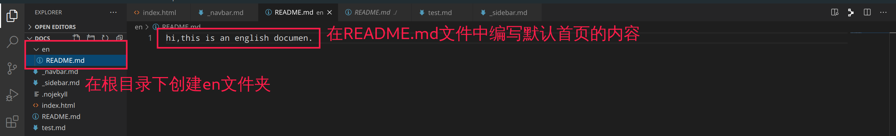
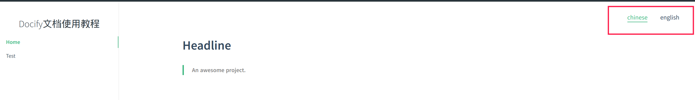
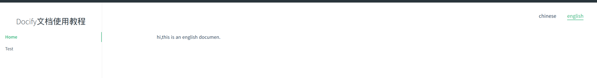
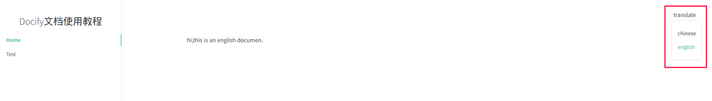
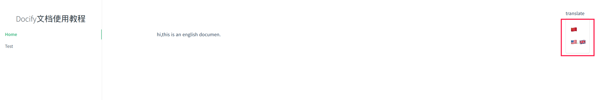
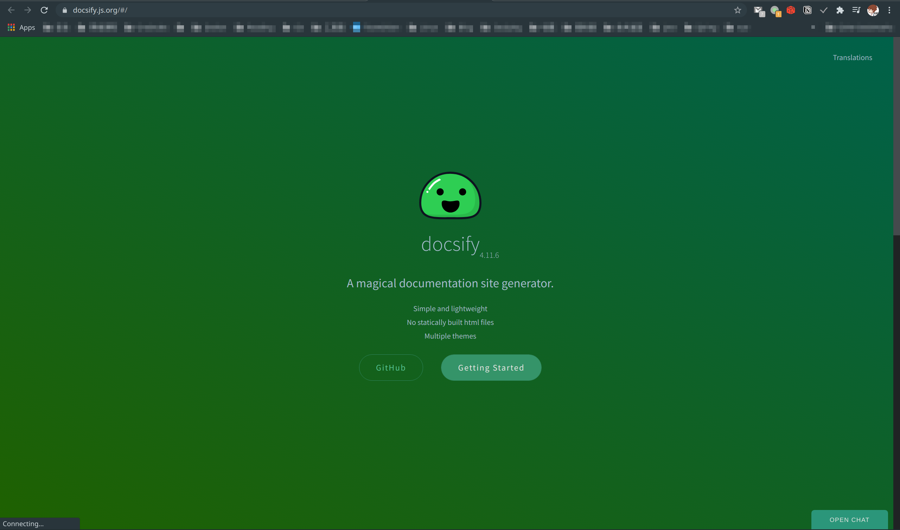
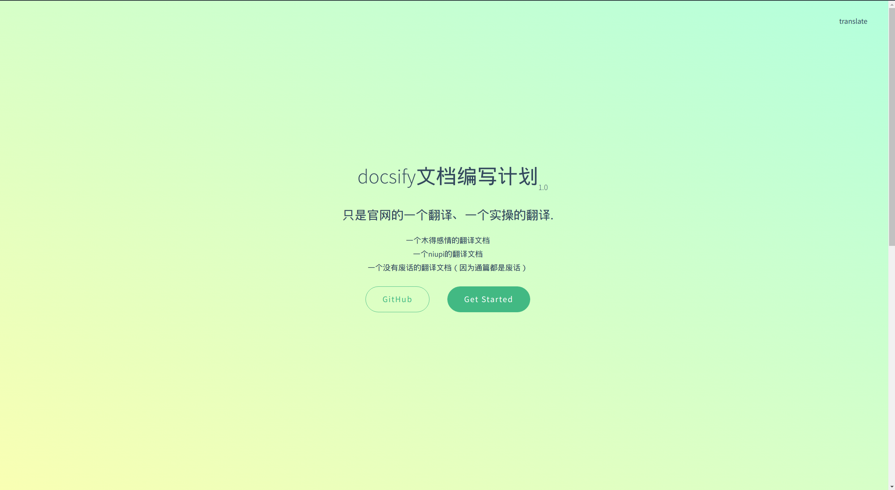
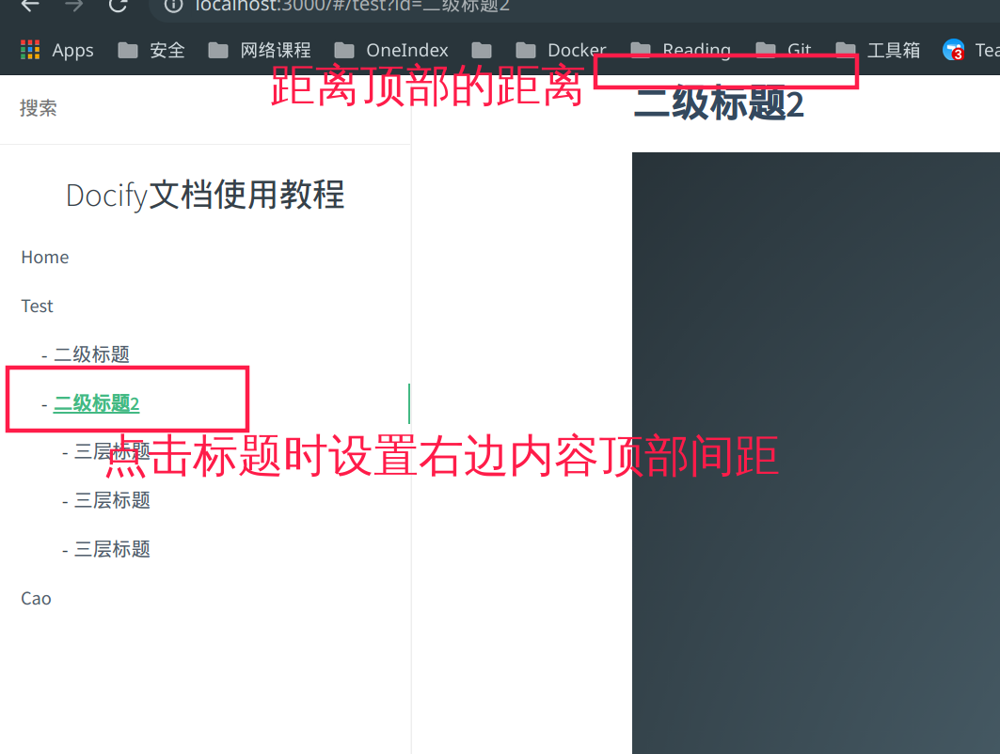
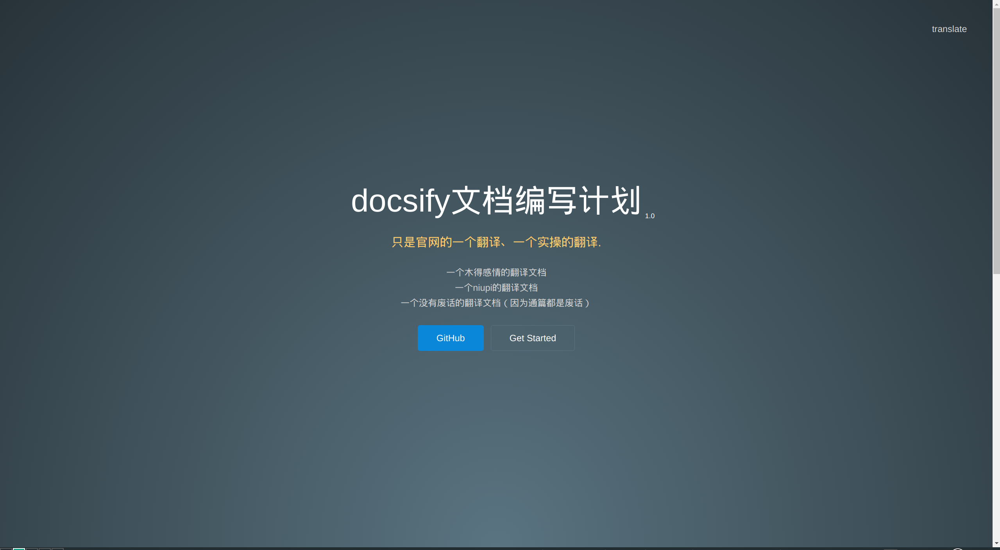
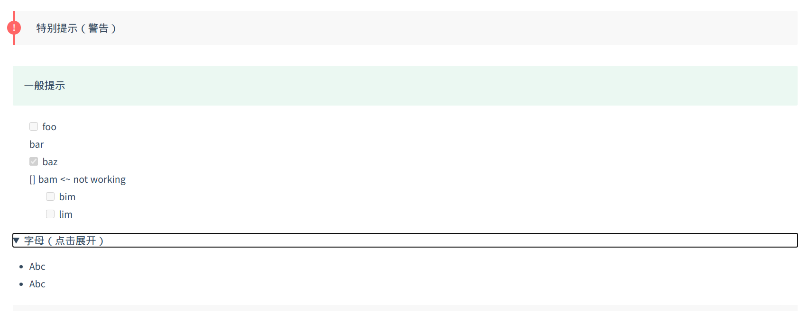

[toc]

## 1.安装nodejs环境
https://gitee.com/shafish/ToolMan/blob/master/manjaro_i3wm/i3-user-guide.md#%E5%AE%89%E8%A3%85nodejs

## 2.安装docsify-cli模块
`npm i docsify-cli -g`

## 3.初始化一个docsify目录
`docsify init ./docs`  # 不用先创建docs目录，直接执行命令即可。

## 4.运行你的第一个docsify项目
`cd docs && docsify serve` 
默认访问`http://localhost:3000/#/` 看看下面的效果，ok完美！！！


## 5.docsify目录文件
一个docsify初始项目都包含哪些内容nie:
- index.html  # docsify配置页
- README.md  # 首页 站点根页面
- .nojeyll

### 5.1 Sidebar侧边栏
> 其实侧边栏默认已经开启了的，我们重写侧边栏当然是想自定义一下侧边栏的跳转条目la

首先你需要知道侧边栏对应的markdown文件名为：`_sidebar.md`
然后在index.html配置中设置docsify的侧边栏字段为开启：`loadSidebar: true` （下图看看效果，显示 `Docify文档使用教程` 是设置了name值为`Docify文档使用教程`）


此时`index.html`的配置为：
```js
<script>
  window.$docsify = {
    name: 'Docify文档使用教程',
    loadSidebar: true
  }
</script>
```

- 下面来设置侧边栏的条目咯
明确需求：
我们先在docs根目录下创建一个test.md文件（文件的内容随便写，比如“只是一个test markdown文件”），
再把这个test.md文件加入到我们侧边栏，让我们直接点击它就可以在右边显示其内容可不可以？？ 下面来一起试试吧

之前说到的`_sidebar.md`文件指定了侧边栏的条目，那我们就在docs根目录下创建`_sidebar.md`文件，把下面的代码编写到该文件中：
```md
* [Home](/)
* [Test](test.md)
```
格式：
- [条目显示标题](文件相对路径)
* [条目显示标题](文件相对路径)


完美完成了上面的需求，还附赠了点击Home显示首页内容这个条目功能。

ok，你已经入门如何给docsify文档添加需要的侧边栏条目lie，再创建一个第一章条目放到侧边栏试试？

> 题外：`_sidebar.md`文件可以为不同的目录显示不同的侧边栏，具体的做法就是在不同的目录下创建不同的`_sidebar.md`就好了，四不四很直接。
> 当然如果创建的目录没有`_sidebar.md`侧边栏文件，docsify会自动加载根目录下的`_sidebar.md`作为侧边栏。

#### 5.1.2在Sidebar侧边栏显示内容标题
这里的标题意思是条目对应右边内容的一级标题、二级标题、三级标题、四级标签这些。（一级标签当然是条目本身la）
先看看效果：


点击test条目还会折叠/展开哟。

想要实现这种效果，只需要在`index.html`配置文件中指定`subMaxLevel:4`即可，其中4表示标题的级别数，这里写4表示可以显示包括条目本身内一共4层标题。
在实际文档中我们只需要显示2到3层即可。比如：


#### 5.1.3隐藏某个内容标题，让其不在侧边栏显示
只需要在需要隐藏的标题后加上 `<!-- {docsify-ignore} -->` 即可


> OK!!到这里关于docsify侧边栏的功能你已经完全掌握啦，撒花，继续努力坚持 ！*★,°*:.☆(￣▽￣)/$:*.°★* 。

```js
// 此时的index.html配置文件内容
<body>
  <div id="app">那么猴急干嘛</div>
  <script>
    window.$docsify = {      
      name: 'Docify文档使用教程',
      loadSidebar: true, // 开启自定义侧边栏
      subMaxLevel: 3  //显示条目的多级标题
    }
  </script>
  <script src="//cdn.jsdelivr.net/npm/docsify/lib/docsify.min.js"></script>
</body>
```

下面进入导航栏的设置

### 5.2 navbar导航栏
跟侧边栏需要编写`_sidebar.md`相似，添加导航栏也同样需要编写一个叫`_navbar.md`的markdown文件

- 5.2.1配置文件开启导航拦开关
`loadNavbar: true`

- 5.2.2需求：给导航栏添加一个中英文显示开关
既然导航栏跟`_navbar.md`相关，那我们按照上面需求来编写该文件吧：

在docs根目录下创建一个`_navbar.md`文件，编写以下内容
```md
* [chinese](/)
* [english](/en/)
```
`/`表示当前docs根目录
`/en/`表示当前docs根目录下的en文件夹，这个文件夹我们之前还没有创建，尝试创建`docs/en/`后创建一个首页`README.md`写些内容后看看效果怎么样：






可以看到点击chinese显示的是根目录下的内容，而点击english则显示根目录下`en`文件夹的内容。

- 5.2.3折叠导航栏条目
把导航栏的条目进行一个分类怎么样？
```md
* translate

    * [chinese](/)
    * [english](/en/)
```
再看看效果：


完美

- 5.2.4使用国旗来表示国家
用文字表示国家-表示有点单调，我们下面来使用docsify的`emoji`插件来获取国家的国旗

  - 在配置文件中引入emoji插件就可以直接在markdown文件中直接使用了，很方便：
  ```md
  <!--index.html-->
  <body>
    <div id="app">那么猴急干嘛</div>
    <script>
      window.$docsify = {      
        name: 'Docify文档使用教程',
        loadSidebar: true,
        subMaxLevel: 3,
        loadNavbar: true
      }
    </script>
    <script src="//cdn.jsdelivr.net/npm/docsify/lib/docsify.min.js"></script>
    <script src="//cdn.jsdelivr.net/npm/docsify/lib/plugins/emoji.min.js"></script>
  </body>
  ```
  引入了：`<script src="//cdn.jsdelivr.net/npm/docsify/lib/plugins/emoji.min.js"></script>`

  - `_navbar.md`中使用
  ```md
  * translate

    * [:cn:](/)
    * [:us:, :uk:](/en/)
  ```

来看看效果吧：


基本的导航栏设置你就学会了哟。中场休息一下吧！！

### 5.3 conver欢迎页面
docsify的欢迎页面是个啥，先来看看效果：


经过上面`_sidebar` `_navbar`这个两个功能设置，相信你已经熟悉docsify添加页面的套路了：`在配置文件中开启对应开关`+`创建对应文件`。

毫无疑问，添加docsify欢迎页的套路也是一毛一样的。

- 5.3.1配置文件开启欢迎页开关
`coverpage: true`

- 5.3.2编写`_coverpage.md`欢迎页文件
```md
# docsify文档编写计划 <small>1.0</small>

> 只是官网的一个翻译、一个实操的翻译.

- 一个木得感情的翻译文档
- 一个niupi的翻译文档
- 一个没有废话的翻译文档（因为通篇都是废话）

[GitHub](https://gitee.com/shafish/ToolMan/blob/master/Docsify%E4%BD%BF%E7%94%A8%E6%96%87%E6%A1%A3.md)
[Get Started](#Headline)
```

来看看效果：


有点意思咧，[Get Started](#Headline)跳转的`#Headline`是根目录下的README.md的一级标题。

官方文档还有关于各目录下的`_coverpage.md`设置，但个人感觉只显示项目根目录下一个欢迎页就可以了，需要设不同目录滴盆友请看看官方文档。

欢迎页的设置就这么简单的完成了！！

### 5.4 Docsify的配置项介绍
这里的配置项是指`index.html` `<script>`js脚本中设置的内容。下面输出一个我们前面配置的所有内容：
```html
<!DOCTYPE html>
<html lang="en">
<head>
  <meta charset="UTF-8">
  <title>Document</title>
  <meta http-equiv="X-UA-Compatible" content="IE=edge,chrome=1" />
  <meta name="description" content="Description">
  <meta name="viewport" content="width=device-width, user-scalable=no, initial-scale=1.0, maximum-scale=1.0, minimum-scale=1.0">
  <link rel="stylesheet" href="//cdn.jsdelivr.net/npm/docsify/lib/themes/vue.css">
</head>
<body>
  <div id="app">那么猴急干嘛，人家还没准备好呢</div>  <!--内容加载完成前，浏览器页面显示的内容-->
  <script>
    window.$docsify = {      
      name: 'Docify文档使用教程',
      loadSidebar: true,
      subMaxLevel: 3,
      loadNavbar: true,
      coverpage: true
    }
  </script>
  <script src="//cdn.jsdelivr.net/npm/docsify/lib/docsify.min.js"></script> <!--docsify模块-->
  <script src="//cdn.jsdelivr.net/npm/docsify/lib/plugins/emoji.min.js"></script> <!--docsify emoji组件-->
</body>
</html>
```
下面慢慢来一个个介绍：
- 1.`<div id="app">内容</div>`：body标签就这一个容器可以装显示内容，毫无疑问，我们编写的markdown文件最终要加载到这个div标签体中。
- 2.`id`：默认如果值为app，docsify会自动绑定$docsify对象，但是我们改为`id="main"` `id="shafish"` `id="帅比"` 行不行？使用`el`跟`$docsify对象`绑定即可。这也是vue的入门用法。
- 3.`el`:把上面`index.html`文件body标签改为以下内容：（只改了绑定的id值，最终显示的效果也是一毛一样的）
 ```html
 <body>
  <div id="帅比">那么猴急干嘛，人家还没准备好呢</div>
  <script>
    window.$docsify = {      
      el: '#帅比',
      name: 'Docify文档使用教程',
      loadSidebar: true,
      subMaxLevel: 3,
      loadNavbar: true,
      coverpage: true,
      auto2top: true,
    }
  </script>
  <script src="//cdn.jsdelivr.net/npm/docsify/lib/docsify.min.js"></script>
  <script src="//cdn.jsdelivr.net/npm/docsify/lib/plugins/emoji.min.js"></script>
</body>
</html>
 ```
- 4.`name`：docsify文档的文档主标题（文档最左上方显示的标题）
- 5.`loadSidebar`：开启侧边栏
- 6.`subMaxLevel`：在侧边栏中显示多级标题（使用数字表示显示多少层级标题）
- 7.`loadNavbar`：开启导航栏
- 8.`coverpage`：开启欢迎页
- 9.`externalLinkTarget`：markdown文件中链接的跳转方式：_blank
- 10.`requestHeaders`:请求头内容 'x-token': 'xxx'这些
- 11.`notFoundPage`：设置404内容，对应`_404.md`文件
- 12.`auto2top`:文件的访问路径修改后自动跳转到文章顶部
- 13.`homepage`：文件夹的默认显示内容，如果不设置该值，默认显示`README.md`中的内容
- 14.`basePath`:设置文件的访问域名，可以指定文件的访问路径，比如你的docsify文件存放在`https://shafish.cn/docs`目录下，该目录下包含README.md、test.md等等文件，你就可以直接设置basepath为：`https://shafish.cn/docs`，否则默认为当前根目录。（该配置可提供动态加载别的目录下文件的访问）
- 15.`relativePath`:开启相对路径，为`true`后可以在路由中使用`..`表示上层目录，`.`表示当前目录
- 16.`logo`:可以在侧边栏设置一个文档的图标
- 17.`themeColor: '#3F51B5'`:可以设置主题的颜色
- 18.`alias`：可以设置路由的别名，在本地访问路径过长或者文件名过长的情况下设置一个唯一值。
- 19.`autoHeander`：为true可以在右边内容的顶部显示文件名作为开头。
- 20.`mergeNavbar`：在小屏下侧边栏和导航栏到合并在一起显示
- 21.`formatUpdated`说可以显示文件的修改时间（没看到显示在哪）
- 22.`noCompileLinks: ['/foo', '/bar/.*'],`：表示/foo和/bar文件夹下的所有文件中的链接不经过docsify hash等处理 https://github.com/docsifyjs/docsify/issues/203

- 23.`topMargin: 0`，0代表几乎贴到浏览器书签栏，可以设置为10等间隔一下



> https://docsify.js.org/#/configuration

### 5.5设置docsify显示主题
docsify默认提供的主题是头文件中的：`<link rel="stylesheet" href="//cdn.jsdelivr.net/npm/docsify/lib/themes/vue.css">`，更换主题时只需要替换该文件即可。
```js
<link rel="stylesheet" href="//cdn.jsdelivr.net/npm/docsify/themes/vue.css">
<link rel="stylesheet" href="//cdn.jsdelivr.net/npm/docsify/themes/buble.css">
<link rel="stylesheet" href="//cdn.jsdelivr.net/npm/docsify/themes/dark.css">
<link rel="stylesheet" href="//cdn.jsdelivr.net/npm/docsify/themes/pure.css">
<link rel="stylesheet" href="https://cdn.jsdelivr.net/npm/docsify-themeable@0/dist/css/theme-defaults.css">
<link rel="stylesheet" href="https://cdn.jsdelivr.net/npm/docsify-themeable@0/dist/css/theme-simple.css">
<link rel="stylesheet" href="https://cdn.jsdelivr.net/npm/docsify-themeable@0/dist/css/theme-simple-dark.css">
```
比如theme-simple-dark.css：


### 5.6Docsify中常见的插件
- 全文搜索
<script src="//cdn.jsdelivr.net/npm/docsify/lib/plugins/search.min.js"></script>

- 图片缩小放大
<script src="//cdn.jsdelivr.net/npm/docsify/lib/plugins/zoom-image.min.js"></script>
使用 排除

- 代码点击复制
<script src="//cdn.jsdelivr.net/npm/docsify-copy-code"></script>

- 上一页/下一页
<script src="//cdn.jsdelivr.net/npm/docsify-pagination/dist/docsify-pagination.min.js"></script>

> ps 选一个合适的主题直接使用即可，主题包含合适的插件(https://docsify.js.org/#/awesome?id=plugins)，再选择适合的插件安装

### 5.7语法高亮和markdown使用设置
- 高亮
docsify文档支持多种语言高亮处理，只需要加入相应语言的js文件即可，比如bash,在配置文件中加入`<script src="//cdn.jsdelivr.net/npm/prismjs@1/components/prism-bash.min.js"></script>`  即可设置bash高亮。
语言对于的js引用地址：https://cdn.jsdelivr.net/npm/prismjs@1/components/

- markdown提示符
`!> 注意`
`?> 一般提示`

- markdown任务列表
```md
- [ ] foo
- bar
- [x] baz
- [ ] bam <~ not working
  - [ ] bim
  - [ ] lim
```
- markdown设置标题id
```
### Hello, world! :id=特别id
```
- markdown缩放/展开列表
```md
<details>
<summary>字母（点击展开）</summary>

- Abc
- Abc

</details>
```



- markdown文件渲染
docsify默认使用[marked](https://github.com/markedjs/marked)来将markdown文件解析为html

### 5.8Docsify文档的部署访问
- 跟静态博客类似，把包含index.html文件的docs文件夹直接放到站点下即可。
- 存放在github中：https://docsify.js.org/#/deploy

### 5.9 PWA（浏览器app）
文档离线功能，可以在断开wifi后刷新查看效果可以在在docs根目录下创建`sw.js`文件，写入以下内容：
```js
/* ===========================================================
 * docsify sw.js
 * ===========================================================
 * Copyright 2016 @huxpro
 * Licensed under Apache 2.0
 * Register service worker.
 * ========================================================== */

const RUNTIME = 'docsify'
const HOSTNAME_WHITELIST = [
  self.location.hostname,
  'fonts.gstatic.com',
  'fonts.googleapis.com',
  'cdn.jsdelivr.net'
]

// The Util Function to hack URLs of intercepted requests
const getFixedUrl = (req) => {
  var now = Date.now()
  var url = new URL(req.url)

  // 1. fixed http URL
  // Just keep syncing with location.protocol
  // fetch(httpURL) belongs to active mixed content.
  // And fetch(httpRequest) is not supported yet.
  url.protocol = self.location.protocol

  // 2. add query for caching-busting.
  // Github Pages served with Cache-Control: max-age=600
  // max-age on mutable content is error-prone, with SW life of bugs can even extend.
  // Until cache mode of Fetch API landed, we have to workaround cache-busting with query string.
  // Cache-Control-Bug: https://bugs.chromium.org/p/chromium/issues/detail?id=453190
  if (url.hostname === self.location.hostname) {
    url.search += (url.search ? '&' : '?') + 'cache-bust=' + now
  }
  return url.href
}

/**
 *  @Lifecycle Activate
 *  New one activated when old isnt being used.
 *
 *  waitUntil(): activating ====> activated
 */
self.addEventListener('activate', event => {
  event.waitUntil(self.clients.claim())
})

/**
 *  @Functional Fetch
 *  All network requests are being intercepted here.
 *
 *  void respondWith(Promise<Response> r)
 */
self.addEventListener('fetch', event => {
  // Skip some of cross-origin requests, like those for Google Analytics.
  if (HOSTNAME_WHITELIST.indexOf(new URL(event.request.url).hostname) > -1) {
    // Stale-while-revalidate
    // similar to HTTP's stale-while-revalidate: https://www.mnot.net/blog/2007/12/12/stale
    // Upgrade from Jake's to Surma's: https://gist.github.com/surma/eb441223daaedf880801ad80006389f1
    const cached = caches.match(event.request)
    const fixedUrl = getFixedUrl(event.request)
    const fetched = fetch(fixedUrl, { cache: 'no-store' })
    const fetchedCopy = fetched.then(resp => resp.clone())

    // Call respondWith() with whatever we get first.
    // If the fetch fails (e.g disconnected), wait for the cache.
    // If there’s nothing in cache, wait for the fetch.
    // If neither yields a response, return offline pages.
    event.respondWith(
      Promise.race([fetched.catch(_ => cached), cached])
        .then(resp => resp || fetched)
        .catch(_ => { /* eat any errors */ })
    )

    // Update the cache with the version we fetched (only for ok status)
    event.waitUntil(
      Promise.all([fetchedCopy, caches.open(RUNTIME)])
        .then(([response, cache]) => response.ok && cache.put(event.request, response))
        .catch(_ => { /* eat any errors */ })
    )
  }
})
```

然后在index.html中添加以下内容：
```js
  if (typeof navigator.serviceWorker !== 'undefined') {
    navigator.serviceWorker.register('sw.js')
  }
```

### 5.10 markdown中的嵌入式标签:video, audio, iframes, code， markdown
> 只需要在末尾添加 `':include'`即可，docsify会自动识别资源加载，识别资源包括：`.html` `.htm` `.markdown` `.md` `.mp3` `.mp4` `.ogg`
  - 嵌入markdown内容：
  `[embed](_media/embed.md ':include')`
  - 嵌入视频：
  `[the alu](https://down.shafish.cn/7.mp4 ':include')`

### 5.11 SSR 服务端渲染[待续]
安装`now` 和 `docsify-cli`模块