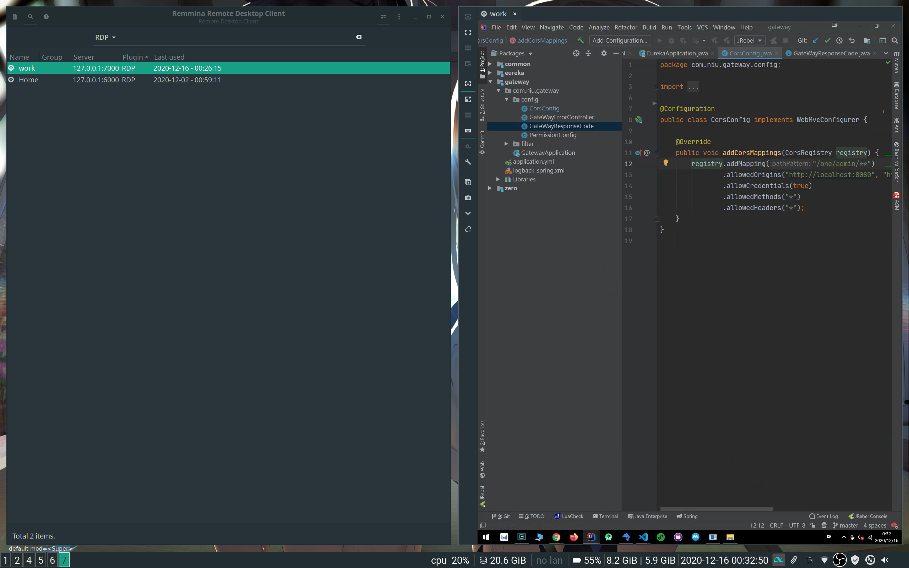

## 零、FRP介绍
因为双十一阿里云服务器打折，新用户购买2c4g的esc`三年`只需要`￥ 699.35`，至于本人一个老阿里云用户怎么弄到新用户esc，我只想说：“这件事大家懂得都懂，不懂得，说了你也不明白，不如不说。你们也别来问我怎么了，利益牵扯太大，说了对你.......”

至于FRP，这是一个用于内外穿透的软件，简单易用，几乎一键小白操作（如果不踩到坑的话）。那内网穿透可以做些什么？？
- 远程桌面（RDP）
    - 如果宁体验过teamviewer、花生壳或者向日葵这些远程桌面软件的话，就可以把内网穿透理解为是一个可以远程桌面的东西，如果有点理解无能的话，我只想说：“这件事大家懂得都懂，不懂得，说.......“
- 远程SSH
    - 用过服务器的同学都知道，远程终端登录
- 远程WEB
    - 被控制端（比如家里的电脑）运行一个web程序（php/vue/其它）就可以通过远程tcp进行访问。

简而言之就是一个让你在外面也可以访问你家里设备的东吸。至于为什么选择frp，前面也说了，简单小白，另外就是ngrok1.7+不开源咧（技术人开始搞小钱钱），没什么好说的。

这里是FRP的官方文档说明--》[gofrp](https://gofrp.org/docs/) ，下面开始尝试在阿里云上搭建`FRP`来进行rdp远程桌面吧，搭完后你就可以方便滴远程办公了哟。[微笑]

## 一、服务端部署
- 1. 到[frp](https://github.com/fatedier/frp/releases)下载`frp_xxx_linux_amd64.tar.gz`到服务器`/opt`目录下
- 2. 解压`tar -zxvf frp_xxx_linux_amd64.tar.gz` 然后进入`cd frp_xxx_linux_amd64`
- 3. 修改配置文件`frps.ini`
```shell
[common]
# frp监听的端口，默认是7000，可以改成其他的
bind_port = 7000
# 授权，随便设置，建议设置复杂点哟
token = fafaefajfoafjo
# frp管理后台端口，可以登录查看被控制设备的上线状态、最高网络传输速度、使用的流量等等状态
dashboard_port = 7500
# frp管理后台用户名和密码，自行设置哟
dashboard_user = admin
dashboard_pwd = admin
enable_prometheus = true
# 日志配置
log_file = /var/log/frps.log
log_level = info
log_max_days = 3
```
- 4. 启动frp服务
```shell
mkdir -p /etc/frp
cp frps.ini /etc/frp
cp frps /usr/bin
cp systemd/frps.service /usr/lib/systemd/system/
# 如果不清楚对应的执行命令可以康康frps.service文件里面的执行命令都写了啥
# service使用参考：https://gitee.com/shafish/linux-usage-record/blob/master/linux%E5%90%AF%E5%8A%A8%E5%88%9D%E5%A7%8B%E5%8C%96.md
systemctl enable frps
systemctl start frps
```
- 5. 防火墙开端口
```shell
# 使用阿里云的一个大坑
# 在服务器部署完成项目后，在安全组中开发对应端口，死活跑不了，最后用firewall-cmd命令查
# 原来是没开端口，安全组和服务器端口还真tm不是一回事
firewall-cmd --zone=public --query-port=7007/tcp  # 查询对应的端口是否开启
firewall-cmd --zone=public --add-port=7000/tcp --permanent # 开启某个端口
firewall-cmd --zone=public --add-port=7500/tcp --permanent # 开启某个端口
firewall-cmd --zone=public --remove-port=9200/tcp --permanent # 关闭某个端口
firewall-cmd --reload # 重启防火墙使配置生效
```
> 开完端口后，记得重启一下防火墙服务

- 6. 再去阿里云安全组辣里开放对应端口

> OK！服务端配置完成！！

## 二、被控制客户端
> 被控制端如果是window系统，要求的版本要得至少是专业版哟（家庭版就别弄了，直接用linux吧）

### Window
- 0. 设置允许被远程控制：


- 1. 到[frp](https://github.com/fatedier/frp/releases)下载`frp_xxx_windows_amd64.zip`到随意目录下
- 2. 解压`frp_xxx_windows_amd64.zip` 然后进入该目录`cd frp_xxx_windows_amd64`
- 3. 修改配置文件`frpc.ini`
```shell
[common]
# 对于服务的frp的配置来填写
server_addr = xxx  # 服务器ip
server_port = 7000 # 服务器上frp启动的端口
token = fafaefajfoafjo # 服务器上frp上设置的token

[RDP]
type = tcp
local_ip = 你电脑在内网ip（ipconfig查看）
# 3389默认远程桌面使用的端口
# 修改默认端口：https://blog.csdn.net/xishining/article/details/94683781
local_port = 3389
remote_port = 7001
```
- 4. 启动frp服务
```shell
.\frpc.exe -c frpc.ini
```
- 5. 服务器防火墙开端口
```shell
firewall-cmd --zone=public --add-port=7001/tcp --permanent # 开启某个端口
```
- 6. 再去阿里云安全组辣里开放对应端口

OK！被控制端（window）配置完成！！

- 7. 开机自启动frp
```shell
# 下载winsw工具：点击下载其中的 WinSW.NET461.exe 文件
https://github.com/winsw/winsw/releases
```
```shell
# 编写winsw.xml文件
<service>
  <id>frp</id>
  <name>frp</name>
  <description>frp service</description>
  <executable>frpc.exe</executable>
  <arguments>-c frpc.ini</arguments>
  <onfailure action="restart" delay="60 sec"/>
  <onfailure action="restart" delay="120 sec"/>
  <logmode>reset</logmode>
</service>
```

将`WinSW.NET461.exe`文件和`winsw.xml`放在`frp_xxx_windows_amd64`目录下，
去`powershell`命令行中执行 `.\winsw install`安装frp服务，再运行`.\winsw start`命令启动frp服务

### Linux
暂时略

## 三、远程桌面使用
- Window自带的远程桌面
    - 计算机名称：服务器ip:remote_port （remote_port是frpc.ini中设置的端口）
    - 用户：被控制端的登录帐号名称
    - 密码：被控制端的登录帐号对应密码
- Remmina
    - 安装完remmina后发现没有rdp选项
    - `sudo pacman -S freerdp`
    - `killall remmina`
    - 再启动Remmina即可
    - ref：https://wiki.archlinux.org/index.php/Remmina
- Finalshell
    - 略
- MicrosoftRemoteDesktop
    - 略



> 略表示本人暂时没有实际操作过或者操作非常简单赖得写
>> 比较容易踩的坑：阿里云设置了对应的安全组而没有在服务器中开启对应端口（不要问为什么是容易踩的坑，问就是不知道[手动狗头]）

## 四、frp中关于安全的一些设置
> 暴露在外网的所有访问都必须参照以下四点要求来进行安全设置！！！！！切记哟！！！！！！！！！！

### 1.更改默认端口
> 比如RDP默认为`3389`、SSH的默认端口为`22`，还有tomcat常用的`8080`等等，都可以将其更改为10000+端口（10000～65535）

- 在window系统更改`3389`端口步骤：
    - 1.1 按`win+r`，输入`regedit`-打开注册表
    - 1.2更改`HKEY_LOCAL_MACHINE\SYSTEM\CurrentControlSet\Control\TerminalServer\Wds\rdpwd\Tds\tcp`下的`PortNumber`值为非`3389`，比如可以设置为`56527`
    - 1.3 更改`HKEY_LOCAL_MACHINE\SYSTEM\CurrentControlSet\Control\Terminal Server\WinStations\RDP-Tcp`的`PortNumber`值为非`3389`，比如可以设置为`56527`
    - 1.4 重启系统后，设置`frpc.ini`中的`local_port`值，再启动即可。

### 2.设置强token
> 在服务器frp启动的配置文件中设置高强度token

数字+字母+符号+30位长度起步（嫌麻烦就直接截取ssh公钥的某段值再往中间插入几个随机数即可）

### 3.设置强帐号密码
> 被控制端（也就是你的window电脑）登录使用的帐号密码`必须`要设置而且`一定！！`不能是弱帐号、弱密码！！

### 4.使用stcp类型
> 如果使用的是tcp类型，可以确保特定的控制端才能连接到被控制端。

- 被控制段的`frpc.ini`设置
```shell
[common]
# 对于服务的frp的配置来填写
server_addr = xxx  # 服务器ip
server_port = 7000 # 服务器上frp启动的端口
token = fafaefajfoafjo # 服务器上frp上设置的token
[RDP]
# type = tcp
type = stcp
# 只有 sk 一致的用户才能访问到此服务，设置复杂点
sk = fafafafooghqog12342379759！@)(×&……%
local_ip = 你电脑在内网ip（ipconfig查看）
# 3389默认远程桌面使用的端口
# 修改默认端口：https://blog.csdn.net/xishining/article/details/94683781
local_port = 3389
remote_port = 7001
```
> 可以看到跟之前的被控制端相比：`type`的值被改成了`stcp`，而且多了`sk`参数！

- 控制端设置
> 没错，使用stcp后，之前控制端不需要运行frp程序的，这次也需要运行frp才可以进行连接。
> 其启动的方式跟被控制端的方式是`一样`的。就只是配置文件不同而已！

```shell
[common]
# 对于服务的frp的配置来填写
server_addr = xxx  # 服务器ip
server_port = 7000 # 服务器上frp启动的端口
token = fafaefajfoafjo # 服务器上frp上设置的token
[rdp_visitor] # 随便天一个
type = stcp
# stcp 的访问者 
role = visitor
# 要访问的 stcp 代理的名字，被控制端的portName，也就是被控制端[RDP]中的RDP
server_name = RDP
# 跟被控制端的sk值一致
sk = fafafafooghqog12342379759！@)(×&……%
# 绑定本地端口用于访问 远程桌面 服务
bind_addr = 127.0.0.1
bind_port = 6000
# 然后启动frp即可window：.\frpc.exe -c frpc.ini
```

> 配置文件中的`common`部分跟被控制端是一样的，`rdp_visitor`部分按照上面对应填入即可。

> 使用`stcp`后，连接远程的地址被映射为了本地的ip:port，也就是`bind_addr`和`bind_port`中指定的`127.0.0.1:6000`

>> 最后打开远程桌面或者remmina填入`127.0.0.1:6000`连接并输入帐号密码即可

### 5. 开启传输加密与压缩
```shell
# 被控制端与控制端中加入以下设置：
use_encryption = true
use_compression = true
```