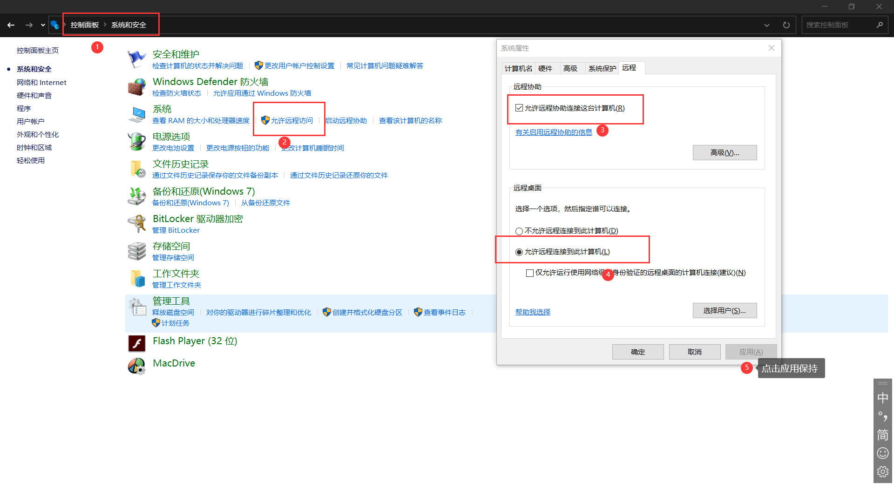
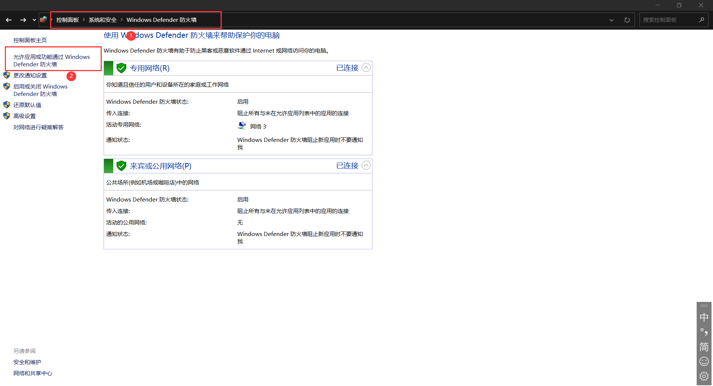
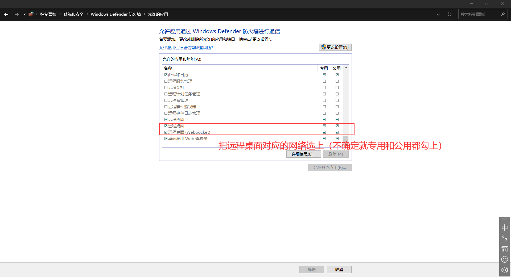

## 一、服务端部署
- 1. 到[frp](https://github.com/fatedier/frp/releases)下载`frp_xxx_linux_amd64.tar.gz`到服务器`/opt`目录下
- 2. 解压`tar -zxvf frp_xxx_linux_amd64.tar.gz` 然后进入`cd frp_xxx_linux_amd64`
- 3. 修改配置文件`frps.ini`
```shell
[common]
# frp监听的端口，默认是7000，可以改成其他的
bind_port = 7000
# 授权，随便设置，建议设置复杂点哟
token = fafaefajfoafjo
# frp管理后台端口，可以登录查看被控制设备的上线状态、最高网络传输速度、使用的流量等等状态
dashboard_port = 7500
# frp管理后台用户名和密码，自行设置哟
dashboard_user = admin
dashboard_pwd = admin
enable_prometheus = true
# 日志配置
log_file = /var/log/frps.log
log_level = info
log_max_days = 3
```
- 4. 启动frp服务
```shell
mkdir -p /etc/frp
cp frps.ini /etc/frp
cp frps /usr/bin
cp systemd/frps.service /usr/lib/systemd/system/
# 如果不清楚对应的执行命令可以康康frps.service文件里面的执行命令都写了啥
# service使用参考：https://gitee.com/shafish/linux-usage-record/blob/master/linux%E5%90%AF%E5%8A%A8%E5%88%9D%E5%A7%8B%E5%8C%96.md
systemctl enable frps
systemctl start frps
```
- 5. 防火墙开端口
```shell
# 使用阿里云的一个大坑
# 在服务器部署完成项目后，在安全组中开发对应端口，死活跑不了，最后用firewall-cmd命令查
# 原来是没开端口，安全组和服务器端口还真tm不是一回事
firewall-cmd --zone=public --query-port=7007/tcp  # 查询对应的端口是否开启
firewall-cmd --zone=public --add-port=7000/tcp --permanent # 开启某个端口
firewall-cmd --zone=public --add-port=7500/tcp --permanent # 开启某个端口
```
- 6. 再去阿里云安全组辣里开放对应端口

> OK！服务端配置完成！！

## 二、被控制客户端
> 被控制端如果是window系统，要求的版本要得至少是专业版哟（家庭版就别弄了，直接用linux吧）

### Window
- 0. 设置允许被远程控制：



- 1. 到[frp](https://github.com/fatedier/frp/releases)下载`frp_xxx_windows_amd64.zip`到随意目录下
- 2. 解压`frp_xxx_windows_amd64.zip` 然后进入该目录`cd frp_xxx_windows_amd64`
- 3. 修改配置文件`frpc.ini`
```shell
[common]
# 对于服务的frp的配置来填写
server_addr = xxx  # 服务器ip
server_port = 7000 # 服务器上frp启动的端口
token = fafaefajfoafjo # 服务器上frp上设置的token

[RDP]
type = tcp
local_ip = 你电脑在内网ip（ipconfig查看）
# 3389默认远程桌面使用的端口
# 修改默认端口：https://blog.csdn.net/xishining/article/details/94683781
local_port = 3389
remote_port = 7001
```
- 4. 启动frp服务
```shell
.\frpc.exe -c frpc.ini
```
- 5. 服务器防火墙开端口
```shell
firewall-cmd --zone=public --add-port=7001/tcp --permanent # 开启某个端口
```
- 6. 再去阿里云安全组辣里开放对应端口

OK！被控制端（window）配置完成！！

### Linux
暂时略

## 三、远程桌面使用
- Window自带的远程桌面
    - 计算机名称：服务器ip:remote_port （remote_port是frpc.ini中设置的端口）
    - 用户：被控制端的登录帐号名称
    - 密码：被控制端的登录帐号对应密码
- Remmina
    - 暂时略
- Finalshell
    - 略
- MicrosoftRemoteDesktop
    - 略

> 略表示本人暂时没有实际操作过或者操作非常简单赖得写
>> 比较容易踩的坑：阿里云设置了对应的安全组而没有在服务器中开启对应端口（不要问为什么是容易踩的坑，问就是不知道[手动狗头]）