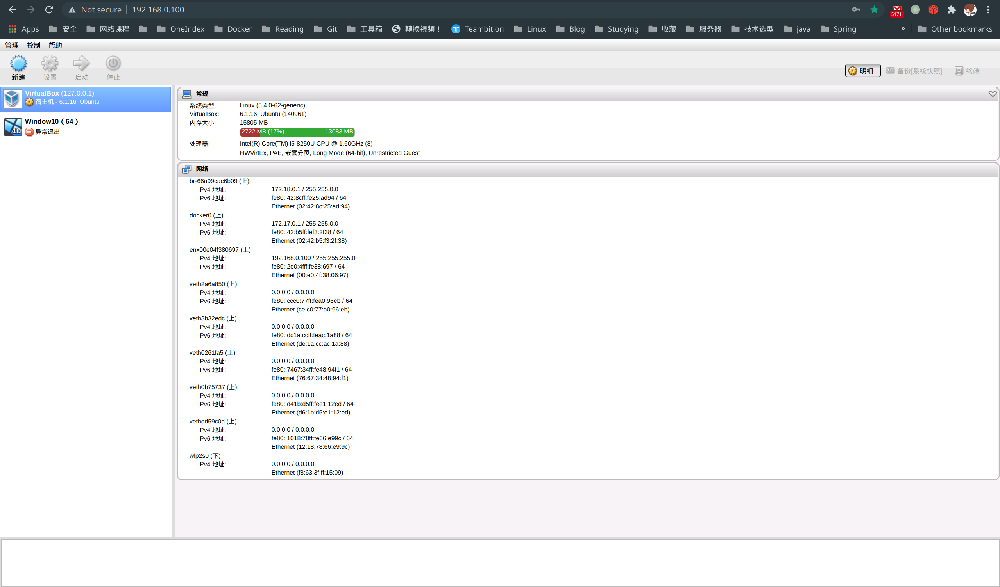

弄了个路边摊摄像头，插上linux电脑没反应，那我在linux下装个window能不能用呢？虽然本机有16G内存，但谷歌浏览器+vscode就是内存大户，流畅跑个window还得占个5、6G内存，根本不够用，看来只能在内网的server中搞点东西了。

> 如何在ubuntu server 20.04中安装virtualbox
> 如何在virtualbox中安装window

## virtualbox安装
```shell
# 安装php跟apache2环境
sudo apt install php7.4 php7.4-xml php7.4-soap apache2
# 重启apache2生效php插件
sudo service apache2 restart
# 下载virtualbox--官方其他下载地址：https://www.virtualbox.org/wiki/Linux_Downloads
cd /var/tmp
sudo wget https://download.virtualbox.org/virtualbox/6.1.18/virtualbox-6.1_6.1.18-142142~Ubuntu~eoan_amd64.deb
# 安装virtualbox安装密钥
wget -q https://www.virtualbox.org/download/oracle_vbox_2016.asc -O- | sudo apt-key add -
wget -q https://www.virtualbox.org/download/oracle_vbox.asc -O- | sudo apt-key add -
# 安装下载的virtualbox deb包
dpkg -i virtualbox-6.1_6.1.18-142142~Ubuntu~eoan_amd64.deb
# 初次安装会提示缺少相关依赖包，使用命令修复后再次安装
sudo apt --fix-broken install
dpkg -i virtualbox-6.1_6.1.18-142142~Ubuntu~eoan_amd64.deb
# 安装dkms
sudo apt install virtualbox-dkms
# 创建运行用户
sudo adduser virtualrunner #密码设为runner110
# 将新用户添加到安装virtualbox安装成功时创建的vboxusers组
sudo usermod -aG vboxusers virtualrunner
# 后台运行virtualbox服务
sudo vboxwebsrv -b -H 127.0.0.1
```
## virtualbox图形操作程序安装
```shell
# 下载到apache2默认访问目录中
cd /var/www/html
sudo git clone https://github.com/phpvirtualbox/phpvirtualbox && cd phpvirtualbox
# 配置连接virtualbox信息
sudo cp config.php-example config.php
sudo vim config.php
```
```shell
# 配置config.php文件中的
# username 前面创建运行virtualbox的新用户
# password 对应的密码
# vrdeaddress 内网访问地址，使用ifconfig确定
/* Username / Password for system user that runs VirtualBox */
var $username = 'virtualrunner';
var $password = 'runner110';
/* Set the default VRDE address, e.g. 192.168.1.1 */
var $vrdeaddress = '192.168.0.100';
```
ok！！
## virtualbox相关操作
### 图形化操作入口
浏览器访问`http://192.168.0.100/phpvirtualbox`，用户名密码均为`admin`




### 下载系统镜像
- [window系统下载](https://msdn.itellyou.cn/)
- [virtualbox增强工具下载](https://download.virtualbox.org/virtualbox/6.1.18/VBoxGuestAdditions_6.1.18.iso)
- 增强工具驱动可以解决键盘鼠标等适配问题，装完window系统再操作
### 系统安装注意问题
> 镜像下载完成后需要进行远程桌面连接才能进行后续的window图像化操作

- 运行内存至少得5G+才能流畅
- 安装远程桌面软件`remmina`：`sudo pacman -S remmina freerdp libvncserver`
- 创建vnc连接：
  - 打开remmina，选择vnc后，输入`192.168.0.100:9000` 或者浏览器输入`vnc://192.168.0.100:9000` (192.168.0.100为自己内网ip)
  - 提示输入的vnc密码需要在设置-显示中配置
  
  
  - 连接上系统后就开始window漫长的安装吧
- virutalbox增强工具在设置-存储-添加新盘，指定驱动的路径，然后在window中直接双击安装重启即可。
- 最后安装成功的样子  
  

>> 之前是打算在virtualbox中安装window，在window下设备应该就可以正常工作，安装完这一切后发现：那摄像头插入在用的manjaro能用了，这

ref:
https://www.himstudy.net/ubuntu-server%E4%B8%8B%E4%BD%BF%E7%94%A8virtualbox%E8%99%9A%E6%8B%9F%E6%9C%BA%E5%AE%89%E8%A3%85%E8%BF%90%E8%A1%8Cwindows/

