## 一、阿里云账号相关设置
- 第一步：登录阿里云控制台并创建子账号：https://usercenter.console.aliyun.com/#/manage/ak。
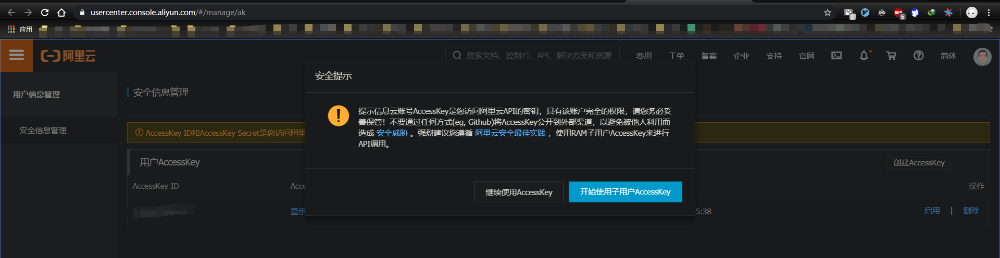
- 第二步：进入跳转页面填上 登录名称、显示名称、勾选编程访问。最后点击确定。
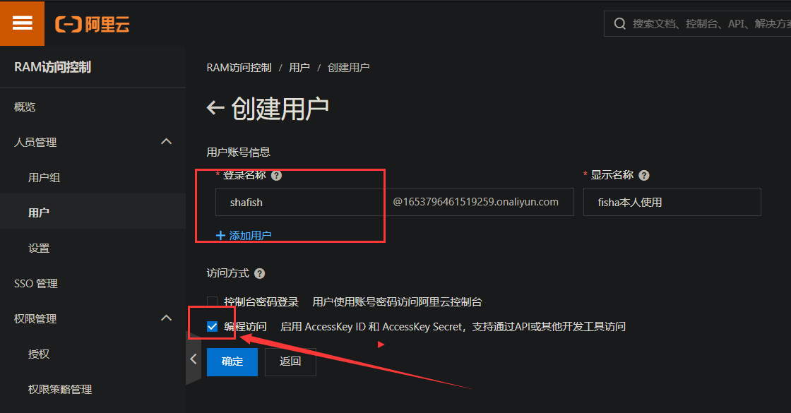
- 第三步：切记需要在本地新建一个记事本保存AccessKey ID和AccessKey Secret信息。
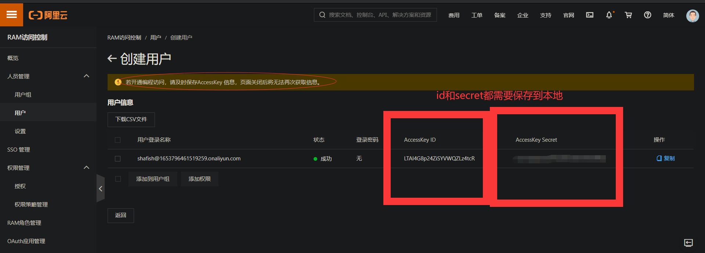
- 可选步骤：
    - 设置用户组功能（可以方便管理多用户权限，如果只有一个用户的话也可以忽略本步骤），填入组相关信息后通过手机验证即可；
    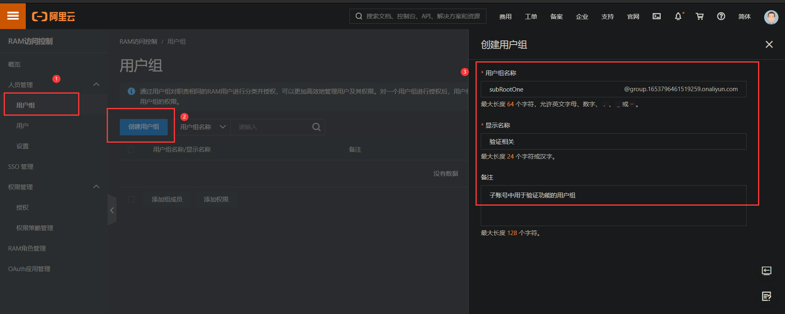
    - 设置用户组权限：在添加组成员功能里添加第二步新建的用户；添加SMS权限
    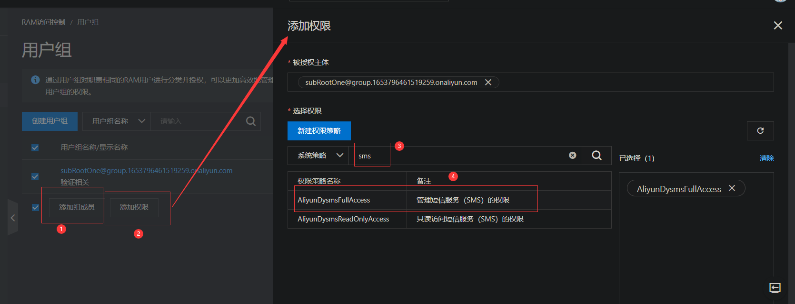
- OK。

## 二、使用阿里的短信验证服务
- 短信服务的基本设置：产品与服务 --> 短信服务
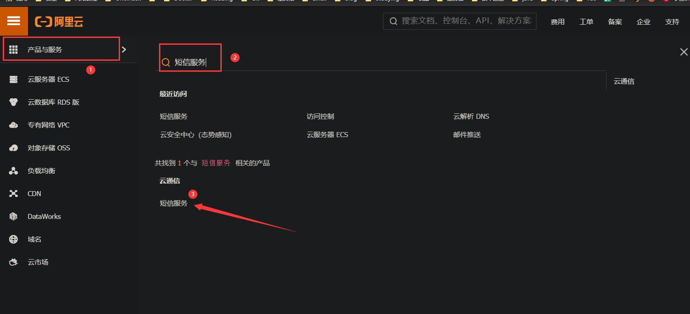
- 设置并记录签名、模板信息：点击国内消息或者国际消息，填写签名管理和模板管理信息，需要审核通过才能用。审核通过后记录签名管理-->`签名名称`；模板管理-->`模版CODE`。
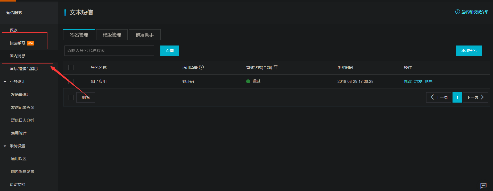
签名是短信开头`[公司名称]`的内容，模板是后面的验证码格式。可参考以下设置：
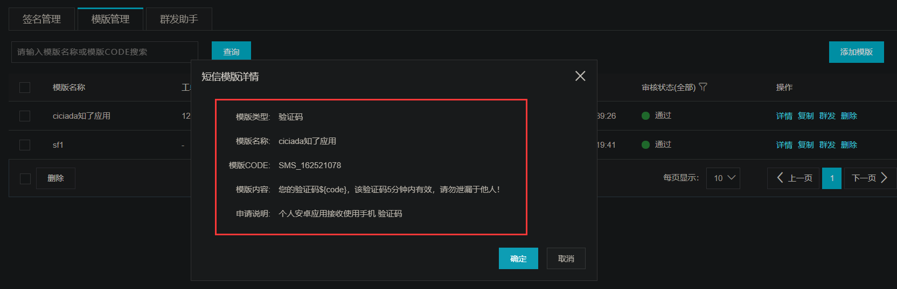
- 查看阿里短信SDK使用方法：
    - 点击帮助文档
    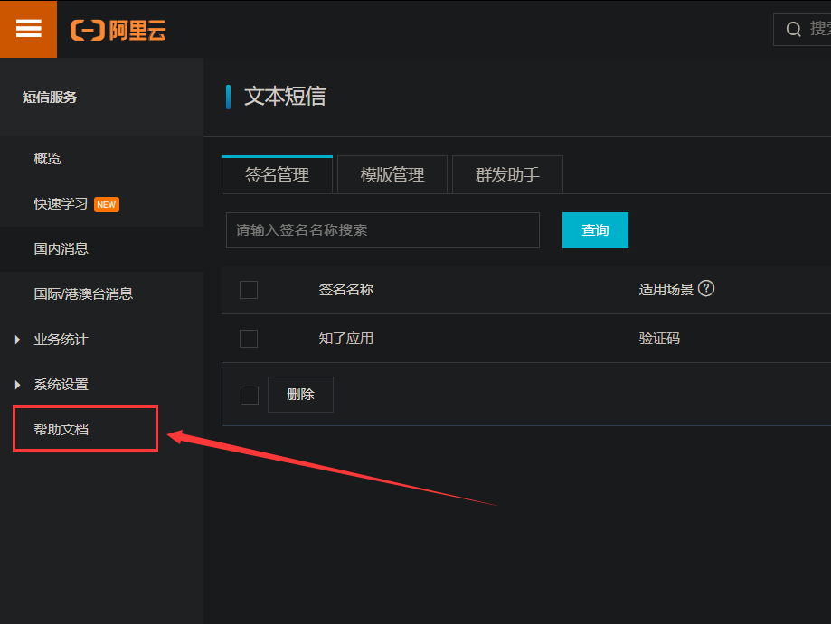
    - 查看SDK的使用流程
    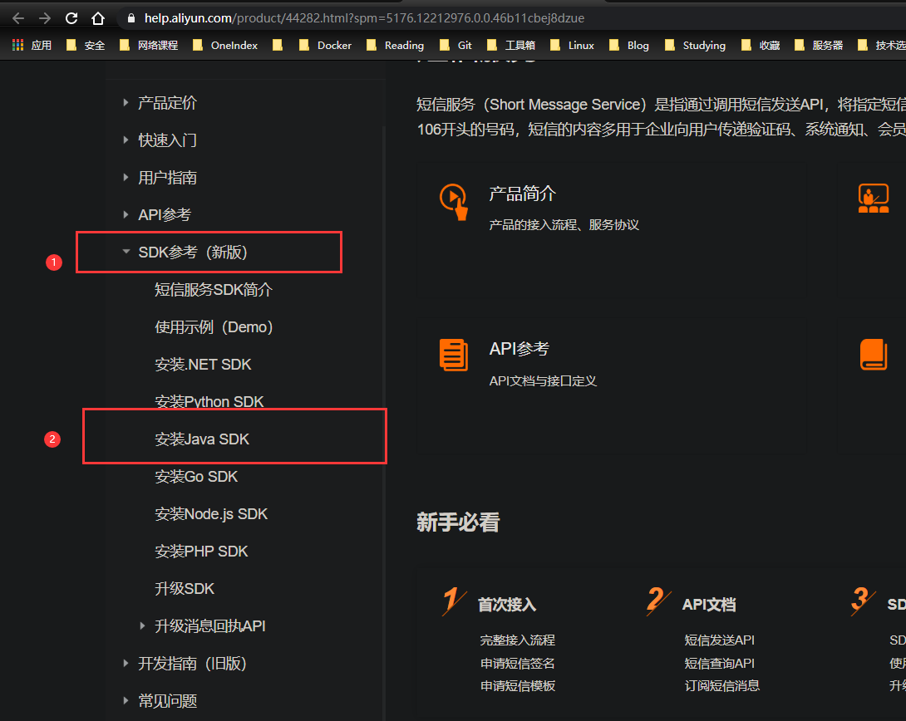
    - 体验短信SDK服务
    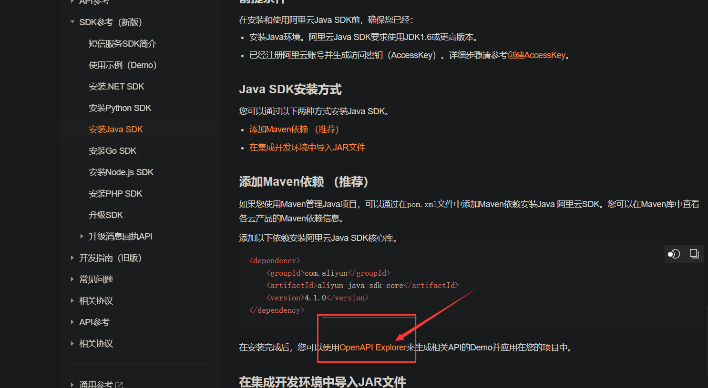
    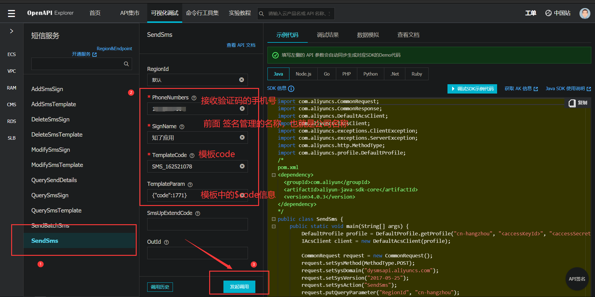
    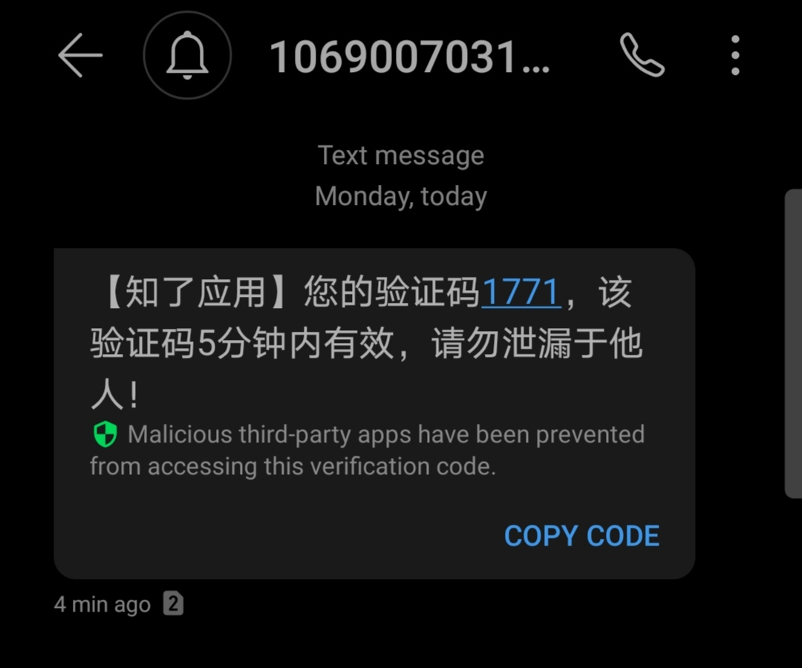
- OK，执行成功说明短信验证的相关设置都没问题，下面把SDK集成到项目中。    

## 三、在项目代码中接入短信验证服务
- 1.新建个springboot项目导入以下maven依赖
```xml
<!--新版ali sms sdk-->
<dependency>
    <groupId>com.aliyun</groupId>
    <artifactId>aliyun-java-sdk-core</artifactId>
    <version>4.1.0</version>
</dependency>
<!--传输json数据-->
<dependency>
    <groupId>com.alibaba</groupId>
    <artifactId>fastjson</artifactId>
    <version>1.2.68</version>
</dependency>
<!--缓存手机对应的验证码-->
<dependency>
    <groupId>org.springframework.boot</groupId>
    <artifactId>spring-boot-starter-data-redis</artifactId>
</dependency>
<dependency>
    <groupId>org.springframework.boot</groupId>
    <artifactId>spring-boot-starter-web</artifactId>
</dependency>
```

- 2.1编写SendSms接口
```java
public interface SendSms {
    public boolean send(String phone, String templateCode, Map<String,Object> params);
}
```
- 2.2编写实现类来实现SendSms接口
```java
@Service
public class SendSmsImpl implements SendSms {
    @Override
    public boolean send(String phone, String templateCode, Map<String, Object> params) {
        // 连接阿里云，需要设置子用户的access信息
        DefaultProfile profile = DefaultProfile.getProfile("cn-hangzhou", "<accessKeyId>", "<accessSecret>");
        IAcsClient client = new DefaultAcsClient(profile);
        // 构建请求信息
        CommonRequest request = new CommonRequest();
        request.setMethod(MethodType.POST);
        request.setDomain("dysmsapi.aliyuncs.com");
        request.setVersion("2017-05-25");
        request.setAction("SendSms");
        request.putQueryParameter("RegionId", "cn-hangzhou");
        // 设置接收的用户手机号
        request.putQueryParameter("PhoneNumbers", phone);
        // 签名名称-公司名称
        request.putQueryParameter("SignName", "知了应用");
        // 短信模板
        request.putQueryParameter("TemplateCode", templateCode);
        request.putQueryParameter("TemplateParam", JSONObject.toJSONString(params));
        try {
            // 响应
            CommonResponse response = client.getCommonResponse(request);
            System.out.println(response.getData());
            return response.getHttpResponse().isSuccess();
        } catch (ServerException e) {
            e.printStackTrace();
        } catch (ClientException e) {
            e.printStackTrace();
        }
        return false;
    }
}
```
- 2.3编写controller对外接口
```java
@RestController
public class SmsApiController {
    @Autowired
    private SendSms sendSms;
    @Autowired
    private RedisTemplate<String,String> redisTemplate;
    @GetMapping("/sendSms/{phone}")
    public String code(@PathVariable("phone") String phone) {
        String code = redisTemplate.opsForValue().get(phone);
        if(!StringUtils.isEmpty(code)) {
            return phone+":"+code+"，验证码还有效，请设置5分钟内不能触发该请求";
        }
        code = UUID.randomUUID().toString().substring(0,4);
        Map<String,Object> map = new HashMap<>();
        // 对应模板中的${code}
        map.put("code",code);
        boolean isSuccess = sendSms.send(phone,"SMS_162521078",map);
        if(isSuccess) {
            redisTemplate.opsForValue().set(phone,code,5, TimeUnit.MINUTES);
            return phone+":"+code+"发送成功";
        } else {
            return "发送失败";
        }
    }
}
```
- 2.4调用接口发送验证码
> http://localhost:8080/sendSms/137xxxxx


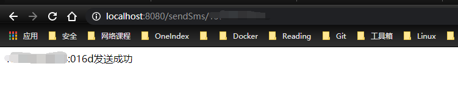

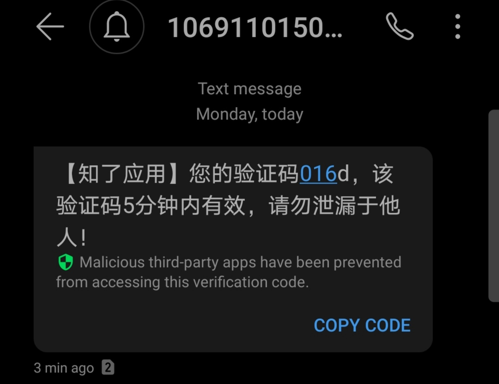

OK！！看看是否接收到了验证码。*★,°*:.☆(￣▽￣)/$:*.°★* 。